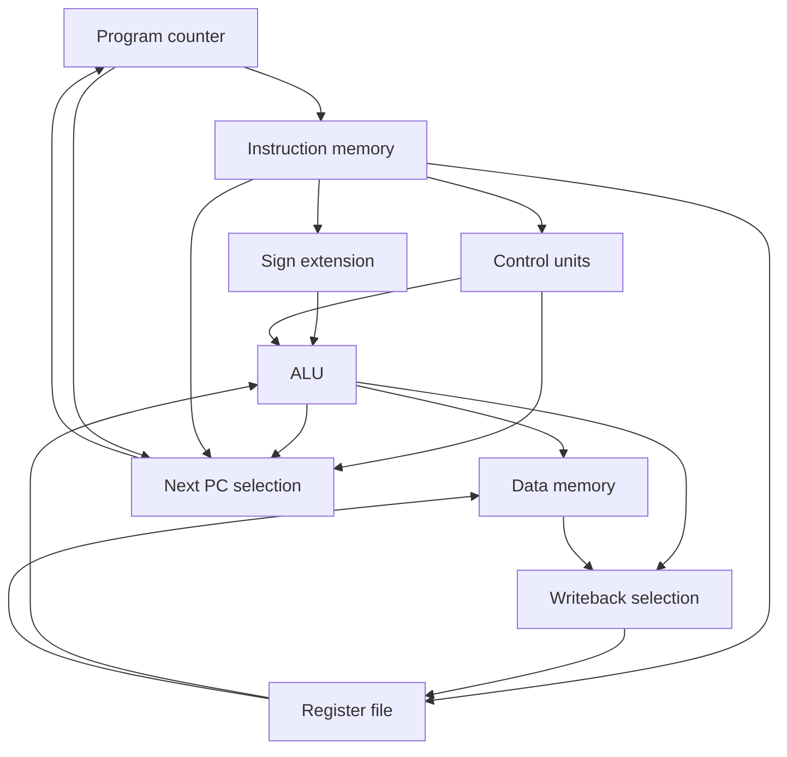

# MIPS processor in Verilog

A 32-bit, single-cycle MIPS subset developed for Computer Architecture coursework at **CEFET-MG**, by **João Victor de Sousa Lima and Ícaro Alves**.

The project connects instruction decoding, register access, a structural ripple-carry adder, an ALU, memory access and control flow in a small processor. The included program exercises a conditional branch, a store/load pair, arithmetic and a jump.

**Scope:** 11 supported instructions, 32 general-purpose register addresses (with register zero protected), separate instruction/data memories, and simulation tests. This is an educational MIPS subset without pipeline registers or branch delay slots.

## Run the tests

Prerequisites: **Icarus Verilog** (`iverilog` and `vvp`) and **GNU Make**. The testbenches use SystemVerilog; the processor RTL is Verilog.

From this directory:

```sh
make test
```

Verified with Icarus Verilog 11.0:

```text
PASS tb_program: 32 checks
PASS tb_isa: 63 checks
PASS tb_alu: 36 checks
```

To produce a waveform for the original program:

```sh
make wave
```

Open `build/program.vcd` in a waveform viewer. Generated simulation files are excluded from Git.

## Supported instructions

| Instruction | Behavior |
| --- | --- |
| `add` | Add two registers |
| `sub` | Subtract two registers |
| `and`, `or`, `nor` | Bitwise logic |
| `slt` | Signed less-than comparison |
| `addi` | Add a sign-extended immediate |
| `lw`, `sw` | Load/store a 32-bit word |
| `beq` | Branch on equality using `PC + 4 + (signed immediate << 2)` |
| `j` | Jump using the upper bits of `PC + 4` and the instruction index |

Arithmetic results wrap to 32 bits. The ALU computes overflow, but the processor does not trap on overflow.

## Datapath



This diagram shows the main data and control relationships; individual multiplexers and control signals are omitted for readability.

## Original demonstration program

Initial register values: `r8 = 5`, `r9 = 5`, `r10 = 1`, `r12 = 4`. Other registers start at zero.

| Byte address | Instruction | Purpose |
| --- | --- | --- |
| 0 | `beq $8, $9, 1` | Skip the next instruction when the registers match |
| 4 | `addi $8, $8, 2` | Increment only when the branch is not taken |
| 8 | `sw $8, 0($12)` | Store at byte address 4 |
| 12 | `lw $16, 0($12)` | Read that word back |
| 16 | `sub $8, $16, $10` | Decrement the loaded value |
| 20 | `j 0` | Restart the loop |

The first loop takes the branch and leaves `r8 = 4`. The next loop executes the increment and leaves `r8 = 5`. `tb_program` checks both paths, memory contents and register writeback.

## Repository contents

| Path | Contents |
| --- | --- |
| `rtl/` | 11 original processor modules |
| `tb/tb_program.sv` | Original program, branch outcomes and memory/register checks |
| `tb/tb_isa.sv` | Independent program covering all 11 supported instructions |
| `tb/tb_alu.sv` | Signed comparisons, arithmetic overflow, zero and logic cases |
| `docs/VALIDATION.md` | Verification results and their scope |
| `docs/PROVENANCE.md` | Source history, authorship and packaging changes |
| `Makefile` | Reproducible build and simulation commands |

## Design boundaries

- Instruction and data arrays each contain 256 words (1 KiB). Use valid, word-aligned addresses; alignment and address exceptions are not implemented.
- Only the demonstration instructions and the first four data words are initialized in RTL. Tests explicitly load their own fixtures. Reading other uninitialized words can produce unknown values in simulation.
- Reset resets the PC only. It does not reinitialize registers or memory, and it does not gate their write enables. Assert reset while the clock is stopped for the included simulations.
- Unsupported opcodes/functions do not raise exceptions. In particular, an unsupported R-type function falls back to the adder. Execute only the documented subset.
- No `jal`, `jr`, shifts, byte accesses, caches, interrupts or operating-system support are included.
- The portfolio package validates simulation. It does not include a verified FPGA pin assignment, synthesis result or measured clock frequency.

## Authorship

Original academic project: **João Victor de Sousa Lima and Ícaro Alves**. See [source provenance](docs/PROVENANCE.md) for the distinction between the coursework RTL and the later test/documentation additions.
